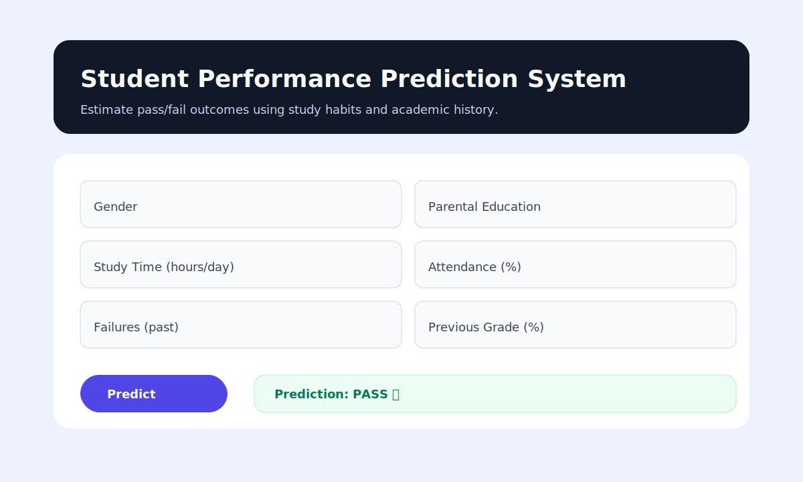
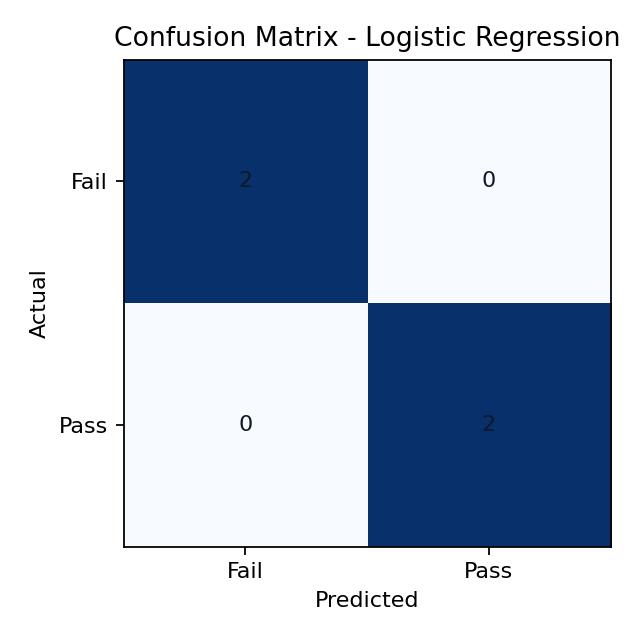

# Student Performance Prediction System

## Overview
This project predicts student academic performance using machine learning.

## Dataset
UCI Student Performance Dataset

## Models Used
Random Forest, Logistic Regression, Decision Tree

## Results
Accuracy achieved: 100% (on the sample dataset)

### UI Preview

### Evaluation Visuals
Confusion matrix image generated after training:

## How to Run
pip install -r requirements.txt
python model/train_model.py
python app.py

## Note
Replace dataset/students.csv with the official UCI Student Performance data for real-world results.
